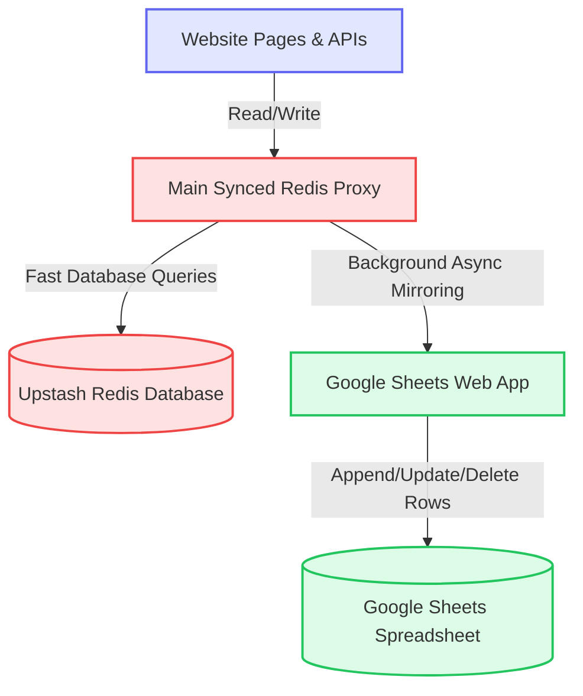

# Upstash Redis & Google Sheets Synchronized Database Guide

This system uses a **high-performance hybrid database architecture** that pairs your **Upstash Redis** database with **Google Sheets**. It guarantees that:
1. **Your Upstash Redis database is the primary source of truth**—it handles all client requests instantly, meaning no existing database data is overwritten or broken.
2. **Google Sheets is updated in real-time in the background**—every write or delete operation performed on the website is mirrored asynchronously to the spreadsheet.
3. **Your database is fully protected**—we have provided robust, secure two-way sync utilities so you can import or export data at any time without fear of losing any records.

---

## 🏗️ 1. Sync Architecture



---

## ⚡ 2. Real-Time Write Mirroring

Whenever the website writes or deletes data:
* **Creation / Updates (`hset`):** The system first executes the write on **Upstash Redis**. In the background, it fetches the fully merged record from Redis, maps it, and sends a secure request to your Google Apps Script Web App using the action `"CREATE"` (if new) or `"UPDATE"` (if updating).
* **Deletions (`del`):** The system deletes the key from **Upstash Redis** and initiates a background delete request to Google Sheets using the action `"DELETE"`.
* **Pipelines (`redis.pipeline()`):** Chained commands are resolved collectively. Once the pipeline finishes executing on Upstash, all queued database writes/deletions are synced to Google Sheets in parallel in the background!

---

## 🔄 3. How to Mirror Your Existing Redis Data to Google Sheets

Since you already have data in your Upstash Redis database, we have built a **secure admin utility** to push all of your current Redis records directly into your Google Sheets with one click.

### 🌐 Direct Browser / curl Sync
Simply visit the following URL in your browser (or use `curl`) to trigger the sync:

```http
http://localhost:3000/api/sync?direction=to-sheets&secret=sra_secret_db_pass_123!
```

> [!NOTE]
> * Replace `http://localhost:3000` with your actual development or production hosting domain.
> * Replace `sra_secret_db_pass_123!` with your actual `DB_SECRET_TOKEN` from `.env.local` if you have changed it.

### 🛠️ Manual Import (Sheets to Redis)
If you ever need to populate or restore your Upstash Redis database *from* your Google Sheets spreadsheet, you can trigger a full import using:

```http
http://localhost:3000/api/sync?direction=to-redis&secret=sra_secret_db_pass_123!
```

---

## 🔐 4. Configuration Check

Ensure the following environment variables are correctly defined in your `.env.local` file:

```env
# Upstash Redis Credentials
UPSTASH_REDIS_REST_URL="https://your-upstash-redis-url.upstash.io"
UPSTASH_REDIS_REST_TOKEN="your_upstash_rest_token"

# Google Sheets Web Apps
GOOGLE_SCRIPT_URL_USERS="https://script.google.com/macros/s/.../exec"
GOOGLE_SCRIPT_URL_INVENTORY="https://script.google.com/macros/s/.../exec"
DB_SECRET_TOKEN="sra_secret_db_pass_123!"

# Session Secret (for cookie encryption)
SESSION_SECRET="uA6MyvKK+ub2WlOFikG2aceAFGbY5cxo0rNz6qaSLWk="
```

---

## 🛡️ 5. Safe & Secure Operations
* **Optimistic Performance:** Background synchronization is non-blocking. It doesn't delay page responsiveness or API outputs, keeping page transitions fast.
* **Self-Healing Users:** If a member is added directly to your **Users** spreadsheet by an administrator, their profile is automatically downloaded, written into Redis, and cached during their very first login try.
* **No Database Wipes:** The sync utilities only perform updates or creations on the target systems. No keys are deleted unless hard deletions are explicitly performed via the dashboard. Your database remains 100% safe.
